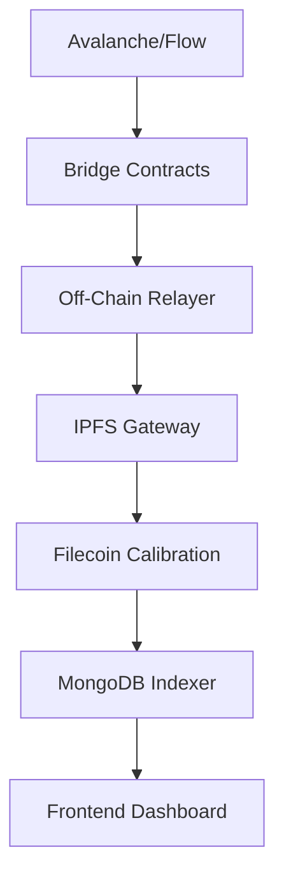

# 🌌 StorageSyncOrbit  
**A cross-chain data bridge protocol for decentralized storage on Filecoin**  

> *"Orbiting across blockchains to unify data storage"*  

This project demonstrates a **cross-chain data bridge** enabling seamless data onboarding from EVM-compatible chains (Avalanche, Arbitrum, Base, Linea) and non-EVM chains (Flow) to **Filecoin** for decentralized storage. It processes storage proposals, verifies cross-chain data integrity, and automates deal creation on Filecoin. Designed for future multi-chain expansion with modular bridge integrations.

---

## 🚀 Key Features  
- **Cross-Chain Data Sync**: Bridge data from Avalanche (Fuji Testnet), Flow (Testnet), and other chains to Filecoin (Calibration Testnet).  
- **Automated Storage Proposals**: Generate and execute Filecoin storage deals via smart contracts and off-chain agents.  
- **Modular Architecture**: Plug-and-play support for new chains (e.g., Linea, Base).  
- **On-Chain Verification**: Use cryptographic proofs (IPFS CID, Merkle roots) to validate data authenticity.  
- **Decentralized Data Indexing**: Query storage records via a MongoDB/PostgreSQL backend.  

---

## 🧰 Tech Stack  
| Layer | Technology | Purpose |  
|-------|------------|---------|  
| **Blockchain** | Avalanche Fuji, Flow Testnet, Filecoin Calibration | Cross-chain demo environment |  
| **Smart Contracts** | Solidity, Cadence | Bridge logic, storage proposal validation |  
| **Storage Layer** | Filecoin (Lotus, Powergate), IPFS | Decentralized storage orchestration |  
| **Backend** | Node.js, Express | Data indexing, deal processing |  
| **Frontend** | React (optional) | UI for interacting with bridges |  
| **Dev Tools** | Hardhat, Foundry, Docker, MongoDB | Development, deployment, and data persistence |  
| **Orchestration** | Chainlink CCIP (planned), IPFS Cluster | Cross-chain communication and data replication |  

---

## 🛰️ Architecture Overview  


1. **Bridge Contracts**: Deployed on source chains (Avalanche/Flow) to emit storage events.  
2. **Relayer Service**: Listens for events, packages data into IPFS, and submits storage proposals to Filecoin.  
3. **Storage Deal Execution**: Filecoin nodes automatically accept deals with predefined parameters.  
4. **Indexing Layer**: Stores metadata (CID, timestamps, chain IDs) for querying.  

---

## 🔧 Prerequisites  
1. **Accounts**:  
   - Filecoin Calibration Testnet wallet ([setup guide](https://docs.filecoin.io/))  
   - Avalanche Fuji Testnet wallet ([wallet link](https://wallet.avax.network/))  
   - Flow Testnet wallet ([Flow CLI setup](https://docs.onflow.org/flow-cli/))  
2. **Tools**:  
   - Node.js (v18+)  
   - Docker (for local Filecoin/IPFS nodes)  
   - Git  
   - Hardhat/Foundry (for contract deployment)  
   - IPFS CLI (`ipfs init`, `ipfs daemon`)  
3. **Dependencies**:  
   - `@filecoin-shipyard/js-filecoin-signer`  
   - `@chainlink/contracts`  
   - `web3.js` or `ethers.js`  
   - `flow-js-sdk`  

---

## 🧪 Getting Started  

### 1. Clone the Repo  
```bash
git clone git@github.com:your-username/StorageSyncOrbit.git
cd StorageSyncOrbit
```

### 2. Install Dependencies  
```bash
npm install
# Or for yarn users:
yarn install
```

### 3. Configure Environment Variables  
Create a `.env` file:  
```env
# Avalanche Fuji
AVAX_RPC_URL=https://api.avax-test.network/ext/bc/C/rpc
AVAX_PRIVATE_KEY=your_private_key_here

# Flow Testnet
FLOW_ACCESS_NODE=https://access.devnet.nodes.onflow.org:9000
FLOW_PRIVATE_KEY=your_flow_private_key

# Filecoin Calibration
FIL_NODE_RPC=https://calibration.node.glif.io/rpc/v1
FIL_WALLET_ADDR=f3y...your_wallet_address
FIL_WALLET_PRIVATE_KEY=your_fil_private_key

# IPFS
IPFS_API_URL=http://localhost:5001
```

### 4. Deploy Bridge Contracts  
```bash
npx hardhat run scripts/deployAvalancheBridge.js --network fuji
npx flow-cli deploy --network testnet
```

### 5. Start Local IPFS Node  
```bash
docker run -d -p 5001:5001 -p 4001:4001 ipfs/kubo
```

### 6. Run Relayer Service  
```bash
node relayer.js
# Listens for events on Avalanche/Flow, processes data into Filecoin deals
```

---

## 🧩 Usage  

### Step 1: Submit Data from Avalanche  
1. Call `submitStorageData(bytes32 hash, uint256 size)` in the Avalanche bridge contract.  
2. The relayer will:  
   - Fetch the data via IPFS  
   - Generate a storage proposal on Filecoin  
   - Update MongoDB with the CID and timestamp  

### Step 2: Query Storage Records  
```bash
curl http://localhost:3000/storage-proposals
# Returns JSON of all CIDs, chain IDs, and timestamps
```

### Step 3: Verify Filecoin Deals  
Check deal status on Filecoin Calibration:  
```bash
filecoin --api-url $FIL_NODE_RPC client deal status <deal_cid>
```

---

## 🌐 Adding New Chains  
1. **Contract Integration**:  
   - Deploy a bridge contract on the new chain (e.g., Base Testnet).  
   - Update relayer to parse events from the new contract.  
2. **SDK Configuration**:  
   - Add chain-specific SDKs (e.g., `ethers.js` for EVM chains).  
3. **Environment Setup**:  
   - Update `.env` with new chain RPC and wallet details.  

---

## 🧪 Testing  

### Unit Tests  
```bash
npx hardhat test
# or for Flow:
npm test
```

### End-to-End Tests  
1. Submit test data to Avalanche/Flow bridge contracts.  
2. Verify CID in IPFS and Filecoin deal status.  

---

## 🛡️ Security Considerations  
- **Rate Limiting**: Prevents spam on Filecoin deal submissions.  
- **Signature Verification**: Ensures cross-chain messages are authenticated.  
- **Reentrancy Guards**: Protect bridge contracts from malicious callbacks.  
- **Private Key Safety**: Never commit `.env` files to version control.  

---

## 📦 Deployment  

### Production Setup  
1. Use Docker for containerized services:  
   ```bash
   docker-compose up -d
   ```
2. Deploy to a cloud provider (e.g., AWS, GCP) with persistent MongoDB.  

---

## 🤝 Contributing  
Contributions welcome!  
1. Fork the repo  
2. Create a feature branch (`git checkout -b add-new-chain-support`)  
3. Submit a pull request with detailed changes  

---

## 📄 License  
MIT License  

---

## 📬 Contact  
For questions, reach out via:  
- Discord: `@your_username`  
- Email: `your_email@example.com`  

---

## 🌟 Acknowledgments  
- Filecoin [Powergate](https://github.com/filecoin-project/powergate)  
- Chainlink CCIP (experimental integration)  
- Flow Devnet team  

---

### 📝 Notes  
- **Testnet Only**: This demo uses testnets for all chains.  
- **Future Plans**: Add zk-SNARKs for trustless cross-chain verification.  

---

This README includes:  
- Project purpose and features  
- Tech stack and architecture  
- Step-by-step setup and usage  
- Security and deployment guidance  
- Contribution workflows  
- Licensing and contact info  

Let me know if you need adjustments to the architecture, contract logic, or relayer code!

This repo demonstrates how to onboard data from Avalanche to Filecoin via a cross-chain data bridge protocol, which processes storage proposals on Filecoin. It could potentially process the data storage coming from multichain, such as Linea, Base, Arbitrum, etc.

The demo consists of the following components:
- **[Demo UI](https://github.com/FIL-Builders/dataBridgeDemo)**: upload file via onramp contract
- **[Onramp Contracts](https://github.com/FIL-Builders/onramp-contracts/)**: accepting storage requests & posdi proof verification.
  -  The onramp contracts were deployed on Filecoin Calibration & Avalanche Fuji testnet. You can find the contract info in [contractDetails.tsx](https://github.com/FIL-Builders/dataBridgeDamo/blob/main/components/contractDetails.tsx).
  - You can also deploy your version of onramp contracts.
- **[xClientClient](https://github.com/FIL-Builders/xchainClient)**: listen to the storage requests from smart contract, aggregate small size of data and send storage deal proposal to SP on Filecoin.

## Getting Started

Make sure you have the following installed:

- Node.js


First, clone the repository:
```bash
git clone https://github.com/FIL-Builders/dataBridgeDemo.git
cd dataBridgeDemo
```

Configure Environment Variables

Copy `.env.sample` to `.env`

Set the JWT from your PINATA API INFO:
```bash
NEXT_PUBLIC_PINATA_JWT=
```

Install all dependencies:
```bash
npm install
```
Then, you can run the development server: 
```bash
npm run dev
```


Open [http://localhost:3000](http://localhost:3000) with your browser to see the result.


