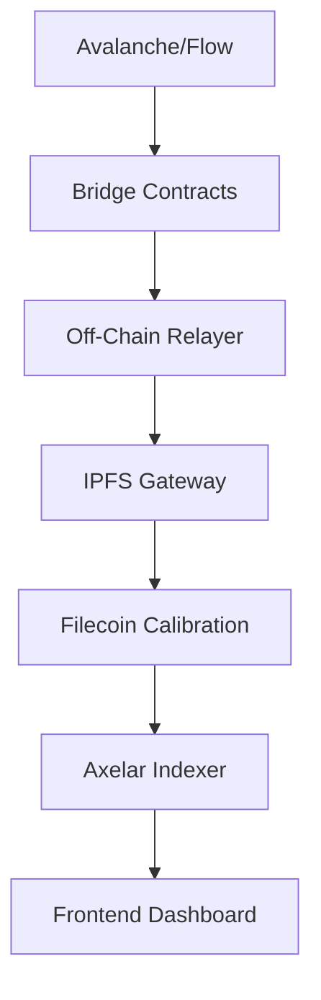

# 🌌 StorageSyncOrbit  
**A cross-chain data bridge protocol for decentralized storage on Filecoin**  

> *"Orbiting across blockchains to unify data storage"*  

This project demonstrates a **cross-chain data bridge** enabling seamless data onboarding from EVM-compatible chains (Avalanche, Arbitrum, Base, Linea) and non-EVM chains (Flow) to **Filecoin** for decentralized storage. It processes storage proposals, verifies cross-chain data integrity, and automates deal creation on Filecoin. Designed for future multi-chain expansion with modular bridge integrations.

---

## 🚀 Key Features  
- **Cross-Chain Data Sync**: Bridge data from Avalanche (Fuji Testnet), Flow (Testnet), and other chains to Filecoin (Calibration Testnet).  
- **Automated Storage Proposals**: Generate and execute Filecoin storage deals via smart contracts and off-chain agents.  
- **Modular Architecture**: Plug-and-play support for new chains (e.g., Linea, Base).  
- **On-Chain Verification**: Use cryptographic proofs (IPFS CID, Merkle roots) to validate data authenticity.  
- **Decentralized Data Indexing**: Query storage records via a MongoDB/PostgreSQL backend.  

---

## 🧰 Tech Stack  
| Layer | Technology | Purpose |  
|-------|------------|---------|  
| **Blockchain** | Avalanche Fuji, Flow Testnet, Filecoin Calibration | Cross-chain demo environment |  
| **Smart Contracts** | Solidity | Bridge logic, storage proposal validation |  
| **Storage Layer** | Filecoin, IPFS, Pinata | Decentralized storage orchestration |  
| **Backend** | Node.js, Solidity| Data indexing, deal processing |  
| **Frontend** | NextJs | RainbowKit UI for interacting with bridges |  
| **Dev Tools** | Hardhat, Foundry,  | Development, deployment, and data persistence |  
| **Orchestration** | Axelar brdge, IPFS Cluster | Cross-chain communication and data replication |  

---

## 🛰️ Architecture Overview  


1. **Bridge Contracts**: Deployed on source chains (Avalanche/Flow) to emit storage events.  
2. **Relayer Service**: Listens for events, packages data into IPFS, and submits storage proposals to Filecoin.  
3. **Storage Deal Execution**: Filecoin nodes automatically accept deals with predefined parameters.  
4. **Indexing Layer**: Stores metadata (CID, timestamps, chain IDs) for querying.  

---

## 🔧 Prerequisites  
1. **Accounts**:  
   - Filecoin Calibration Testnet wallet ([setup guide](https://docs.filecoin.io/))  
   - Avalanche Fuji Testnet wallet ([wallet link](https://wallet.avax.network/))  
   - Flow Testnet wallet ([Flow CLI setup](https://docs.onflow.org/flow-cli/))  
2. **Tools**:  
   - Node.js (v20+)  
   - Docker (for local Filecoin/IPFS nodes)  
   - Git  
   - Hardhat/Foundry (for contract deployment)  
   - IPFS CLI (`ipfs init`, `ipfs daemon`)  
3. **Dependencies**:  
   - `@filecoin-shipyard/js-filecoin-signer`  
   - `@chainlink/contracts`  
   - `web3.js` or `ethers.js`  
   - `flow-js-sdk`  

---

## 🧪 Getting Started  

### 1. Clone the Repo  
```bash
git clone git@github.com:holyaustin/StorageSyncOrbit.git
cd StorageSyncOrbit
```

### 2. Install Dependencies  
```bash
npm install
# Or for yarn users:
yarn install
```

### 3. Configure Environment Variables  
Create a `.env` file:  
```env
# Avalanche Fuji
AVAX_RPC_URL=https://api.avax-test.network/ext/bc/C/rpc
AVAX_PRIVATE_KEY=your_private_key_here

# Flow Testnet
FLOW_ACCESS_NODE=https://testnet.evm.nodes.onflow.org
FLOW_PRIVATE_KEY=your_flow_private_key

# Filecoin Calibration
FIL_NODE_RPC=https://calibration.node.glif.io/rpc/v1
FIL_WALLET_ADDR=f3y...your_wallet_address
FIL_WALLET_PRIVATE_KEY=your_fil_private_key

# IPFS
IPFS_API_URL=http://localhost:5001
```

### 4. Deploy Bridge Contracts  

- see on-ramp contract readme file

### 5. Start Local IPFS Node  
```bash
docker run -d -p 5001:5001 -p 4001:4001 ipfs/kubo
```

### 6. Run Relayer Service  

Usage
1️⃣ Start the xChain server:
```bash
./xchainClient daemon --config ./config/config.json --chain avalanche --buffer-service 
```
--aggregation-service
2️⃣ Upload data using the client tool:
```bash
./xchainclient client offer-file --chain avalanche --config ./config/config.json <file_path> <payment-addr> <payment-amount>
```
3️⃣ Check deal status:
```bash
./xchainClient client dealStatus <cid> <offerId>
```
```bash
node relayer.js
# Listens for events on Avalanche/Flow, processes data into Filecoin deals
---

## 🧩 Usage  

### Step 1: Submit Data from Avalanche  
1. Call `submitStorageData(bytes32 hash, uint256 size)` in the Avalanche bridge contract.  
2. The relayer will:  
   - Fetch the data via IPFS  
   - Generate a storage proposal on Filecoin  
   - Update MongoDB with the CID and timestamp  

### Step 2: Query Storage Records  
```bash
curl http://localhost:3000/storage-proposals
# Returns JSON of all CIDs, chain IDs, and timestamps
```

### Step 3: Verify Filecoin Deals  
Check deal status on Filecoin Calibration:  
```bash
filecoin --api-url $FIL_NODE_RPC client deal status <deal_cid>
```

---

## 🌐 Adding New Chains  
1. **Contract Integration**:  
   - Deploy a bridge contract on the new chain (e.g., Base Testnet).  
   - Update relayer to parse events from the new contract.  
2. **SDK Configuration**:  
   - Add chain-specific SDKs (e.g., `ethers.js` for EVM chains).  
3. **Environment Setup**:  
   - Update `.env` with new chain RPC and wallet details.  

---

## 🧪 Testing  

### Unit Tests  
```bash
npx hardhat test
# or for Flow:
npm test
```

### End-to-End Tests  
1. Submit test data to Avalanche/Flow bridge contracts.  
2. Verify CID in IPFS and Filecoin deal status.  

---

## 🛡️ Security Considerations  
- **Rate Limiting**: Prevents spam on Filecoin deal submissions.  
- **Signature Verification**: Ensures cross-chain messages are authenticated.  
- **Reentrancy Guards**: Protect bridge contracts from malicious callbacks.  
- **Private Key Safety**: Never commit `.env` files to version control.  

---

## 📦 Deployment  

### Production Setup  
1. Use Docker for containerized services:  
   ```bash
   docker-compose up -d
   ```
2. Deploy to a cloud provider (e.g., AWS, GCP) with persistent MongoDB.  

---

## 🤝 Contributing  
Contributions welcome!  
1. Fork the repo  
2. Create a feature branch (`git checkout -b add-new-chain-support`)  
3. Submit a pull request with detailed changes  

---

## 📄 License  
MIT License  

---

## 📬 Contact  
For questions, reach out via:  
- Discord: `@your_username`  
- Email: `your_email@example.com`  

---

## 🌟 Acknowledgments  
- Filecoin [Powergate](https://github.com/filecoin-project/powergate)  
- Chainlink CCIP (experimental integration)  
- Flow Devnet team  

---

### 📝 Notes  
- **Testnet Only**: This demo uses testnets for all chains.  
- **Future Plans**: Add zk-SNARKs for trustless cross-chain verification.  

---

This README includes:  
- Project purpose and features  
- Tech stack and architecture  
- Step-by-step setup and usage  
- Security and deployment guidance  
- Contribution workflows  
- Licensing and contact info  

***** Deploying Contracts on Filecoin *****
Deploying with account: 0x2c3b2B2325610a6814f2f822D0bF4DAB8CF16e16
Axelar Gateway (Filecoin): 0x999117D44220F33e0441fbAb2A5aDB8FF485c54D
Axelar Gas Service (Filecoin): 0xbe406f0189a0b4cf3a05c286473d23791dd44cc6
duplicate definition - InvalidAddress()
duplicate definition - InvalidAddress()
deploying "DealClientAxl" (tx: 0x92890d59d481c097c70b5d3c1b3a293998c3f80a63d431507e57f0e83c190a98)...: deployed at 0x084622e6970BBcBA510454C6145313c2993ED9E4 with 148784092 gas
🚀 Prover_Axelar Contract Deployed at:  0x084622e6970BBcBA510454C6145313c2993ED9E4


***** Deploying Contracts on Source Chain: flow *****
Deploying with account: 0x2c3b2B2325610a6814f2f822D0bF4DAB8CF16e16
Axelar Gateway (Source - flow): 0xe432150cce91c13a887f7D836923d5597adD8E31
Axelar Gateway (Destination - Filecoin): 0x999117D44220F33e0441fbAb2A5aDB8FF485c54D
reusing "OnRampContract" at 0xA2Aea35523a71EFf81283E32F52151F12D5CBB7F
🚀 OnRamp Contract Deployed at:  0xA2Aea35523a71EFf81283E32F52151F12D5CBB7F
deploying "AxelarBridge" (tx: 0x3c2307a395b404b72cb893d42e92b7edcfdc2ec37da59d2ed87463619d804437)...: deployed at 0xFB69D0fb9C892F3565D66bcA92360Ca19B8D9780 with 718372 gas
🚀 Oracle Contract Deployed at:  0xFB69D0fb9C892F3565D66bcA92360Ca19B8D9780


### Step 3: Wire Filecoin with Source Chains
***** Deploying Contracts on Filecoin *****
Deploying with account: 0x2c3b2B2325610a6814f2f822D0bF4DAB8CF16e16
Axelar Gateway (Filecoin): 0x999117D44220F33e0441fbAb2A5aDB8FF485c54D
Axelar Gas Service (Filecoin): 0xbe406f0189a0b4cf3a05c286473d23791dd44cc6
duplicate definition - InvalidAddress()
reusing "DealClientAxl" at 0x084622e6970BBcBA510454C6145313c2993ED9E4
🚀 Prover_Axelar Contract Deployed at:  0x084622e6970BBcBA510454C6145313c2993ED9E4
***** Running Filecoin Configuration *****
DealClientAxl Contract located at:  0x084622e6970BBcBA510454C6145313c2993ED9E4
🔗 Detected source chains: flow
🚀 Configuring DealClientAxl for source chain: flow & 0xFB69D0fb9C892F3565D66bcA92360Ca19B8D9780
✅ Destination chain flow configured: 0x7880658bdd8237699ead5144e34d05d289b685f80c7cdec57b59b571ac57df67
Chain ID: 545
Chain Name: flow
Source Oracle Address: 0xFB69D0fb9C892F3565D66bcA92360Ca19B8D9780
🚀 Configuring DealClientAxl to add GAS for Axelar gas service.
AddGasFunds Transaction sent: 0x9112b90f6c95eabf6ee77e7e196dc51b3723c4e0f36a523a64f4630d0038d214
Transaction confirmed!

### Step 4: Configure Source Chains
